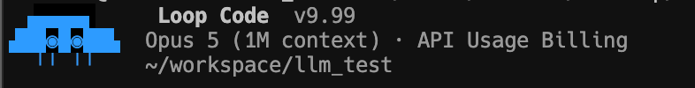

# ccskin

Display-layer theming for the **Claude Code** CLI binary — replace the startup
pixel icon, product name, version display, and theme accent color.
**Display only**: the internal version constant, update checks, API behavior,
and all logic remain untouched.

> 中文文档见 [README.zh.md](README.zh.md) · 坑清单 [docs/pitfalls.md](docs/pitfalls.md)



<sub>Actual result — icon `design/octopus.toml` · name `Loop Code` · version `v9.99` ·
theme color `#2E9BFF`. The model line and everything below it are Claude Code's
own output, untouched.</sub>

## How it works

Claude Code's native binary embeds its JS bundle as plain text. ccskin finds
the display-related string anchors in that text and performs **byte-length-equal
replacements** (offsets stay valid), then re-signs the binary ad-hoc. Pipeline:

```
analyze          patch             sign              verify
find anchors →   equal-byte swap →  ad-hoc re-sign →  icon preview,
(content-based)  (+ .orig backup)  (+ entitlements)   --version, pty capture
```

Anchors are **content-based** (string literals, not offsets or minified
identifiers), so adapting to a new Claude Code release usually just means
re-running the tool. If the structure changes, `analyze` reports exactly what
it couldn't find; `--llm` can ask an LLM for suggestions (OpenAI-compatible
endpoint, advisory only).

## Install

```sh
pipx install git+https://github.com/RGB-loop/ccskin   # or: pip install .
# zero dependencies, Python ≥ 3.9
```

**As an agent skill** — the repo root doubles as a skill directory (`SKILL.md`
included). Install with the [skills CLI](https://skills.sh), which supports
Claude Code, Kimi Code, Codex, Cursor, and many other agents:

```sh
npx skills add RGB-loop/ccskin      # add -g for global scope
```

Or manually: clone straight into your agent's skills directory (the directory
name must be `ccskin`):

```sh
git clone https://github.com/RGB-loop/ccskin ~/.claude/skills/ccskin   # Claude Code
git clone https://github.com/RGB-loop/ccskin ~/.agents/skills/ccskin  # Kimi Code

# then just tell your agent: "给 claude code 换个皮肤" / "skin my claude code"
```

## Quick start

```sh
ccskin skin          # interactive wizard (recommended): auto-locates the
                     # installation, visual pickers for icon/name/version/color
ccskin all --apply -y --pty   # non-interactive one-shot with config defaults
```

The wizard auto-detects your Claude Code (PATH, `~/.claude/local`, homebrew,
etc.), lets you preview and pick an icon (octopus / rocket / invader / ghost),
set the display name and version, pick a theme color, then runs the whole
pipeline and saves your choices to `config.toml`.

## What gets themed

| Element | Sites |
|---|---|
| Startup title | `children:"Claude Code"` + `["v",…]` next to it |
| Input-box border titles | expanded / compact variants |
| Header / task panel | `["Claude Code"," "]` + version slot |
| Pixel icon | 4 animation variants + feet row + body mid (eyes!) |
| HTML login/error page | backtick-template ASCII logo |
| Theme accent color | `claude:` / `clawd_body:` rgb definitions |

Not touched: `--version` output, `/doctor`, update notices, error messages,
and the internal version constant (that's why `--version` still prints the
real version after patching — by design).

## Constraints (physics, not politics)

All replacements must be byte-length equal, therefore:

- display name: ≤ **11 printable ASCII characters** (auto-centered with spaces; the name is spliced into the embedded JS source, so non-ASCII can't be replaced length-equal)
- version display: ≤ **5 chars** (the `["v",…]` code slot), auto-padded
- icon: fixed slot grid per design (`design/*.toml` documents it)
- theme color: any `#RRGGBB` (packed as `rgb(…)` with space padding;
  `ansi:`-based themes are left untouched)

## Custom icons

```sh
ccskin preview design/octopus.toml   # render a design without touching binaries
```

Each slot in a design file holds visible characters; `glyphpack` re-packs them
into the exact escape/literal shape of the original slots. Add your own
`design/*.toml` and point `icon_design` at it.

## Updating Claude Code

Auto-update will overwrite the patch. Either disable auto-updates
(`DISABLE_AUTOUPDATER=1`), or just re-run `ccskin skin` / `ccskin all` after
each update — takes seconds. Restore anytime: `cp <binary>.orig <binary>`.

## Development

```sh
python3 -m unittest discover -s tests -v   # tests run on a synthetic bundle
python3 -m patcher <cmd>                    # run without installing
```

Docs: [README.zh.md](README.zh.md) (中文), [docs/pitfalls.md](docs/pitfalls.md),
[docs/checklist.md](docs/checklist.md), [AGENTS.md](AGENTS.md).

## Legal

This is an unofficial, community-made theming tool. It is **not affiliated
with, endorsed by, or supported by Anthropic**. "Claude Code" is a trademark
of Anthropic. The tool contains **no Anthropic code or binaries** — patch
definitions store offsets + SHA-1 fingerprints, and the original content is
read from your own binary at apply time. For personal/educational use only;
use at your own risk and respect Anthropic's terms of service. Do not use it
to circumvent licensing or payment.

## License

MIT — see [LICENSE](LICENSE).
